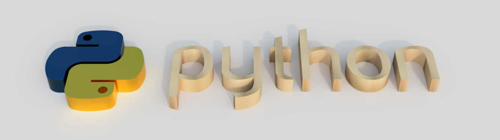

# Introducción a la programación con Python (UCTICEE)

Materiales para el curso de introducción a la programación con Python dentro del proyecto [UCTICEE](http://www3.gobiernodecanarias.org/medusa/ecoescuela/ucticee/) (Uso y Calidad de las TIC en el entorno educativo) cofinanciado al 85% por el [Fondo Europeo de Desarrollo Regional](https://ec.europa.eu/regional_policy/es/funding/erdf/), en el marco del [Plan Canario de Formación del profesorado](https://www3.gobiernodecanarias.org/medusa/perfeccionamiento/areapersonal/aulatic.php?id=30) de la [Consejería de Educación, Universidades, Cultura y Deportes](https://www.gobiernodecanarias.org/educacion/web/) del Gobierno de Canarias.

