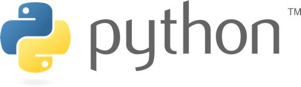

# Introducción al lenguaje de programación Python

Materiales del curso **Introducción al lenguaje de programación Python** ofertado por el [Servicio de Perfeccionamiento](https://www3.gobiernodecanarias.org/medusa/perfeccionamiento/areapersonal/aulatic.php?id=2) para la formación del profesorado dependiente de la [Consejería de Educación, Universidades, Cultura y Deportes](https://www.gobiernodecanarias.org/educacion/) del Gobierno de Canarias.

