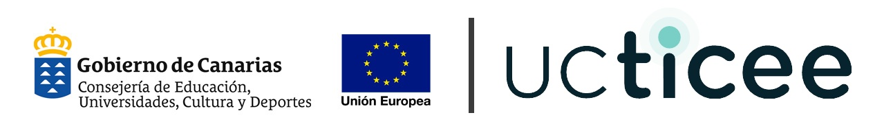

Introducción a la programación con Python (UCTICEE)
===================================================

Materiales para el curso de introducción a la programación con Python dentro del proyecto `UCTICEE`_ (Uso y Calidad de las TIC en el entorno educativo) cofinanciado al 85% por el `Fondo Europeo de Desarrollo Regional`_, en el marco del `Plan Canario de Formación del profesorado`_ de la `Consejería de Educación del Gobierno de Canarias`_.

.. image:: _static/img/python-logo-3d.png

.. _UCTICEE: http://www3.gobiernodecanarias.org/medusa/ecoescuela/ucticee/
.. _Fondo Europeo de Desarrollo Regional: https://ec.europa.eu/regional_policy/es/funding/erdf/
.. _Plan Canario de Formación del profesorado: https://www3.gobiernodecanarias.org/medusa/perfeccionamiento/areapersonal/aulatic.php?id=30
.. _Consejería de Educación del Gobierno de Canarias: https://www.gobiernodecanarias.org/educacion/web/
