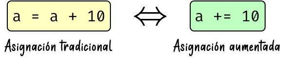
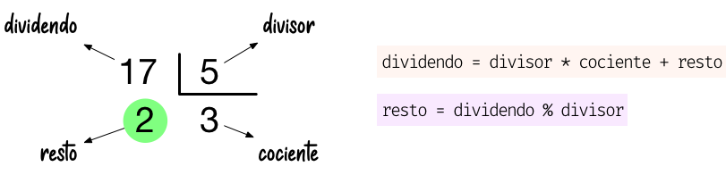

*******
Números
*******

.. image:: img/brett-jordan-4aB1nGtD_Sg-unsplash.jpg

En esta sección veremos los tipos de datos númericos que ofrece Python centrándonos en **booleanos**, **enteros** y **flotantes**. [#dice-unsplash]_

Booleanos
=========

`George Boole`_ es considerado como uno de los fundadores del campo de las ciencias de la computación y fue el creador del `Álgebra de Boole`_ que da lugar, entre otras estructuras algebraicas, a la `Lógica binaria`_. En esta lógica las variables sólo pueden tomar dos valores discretos: **verdadero** o **falso**.

El tipo de datos ``bool`` proviene de lo explicado anteriormente y admite dos posibles valores:

* ``True`` que se corresponde con *verdadero* (y también con **1** en su representación numérica).
* ``False`` que se corresponde con *falso* (y también con **0** en su representación numérica).

Veamos un ejemplo de su uso::

    >>> is_opened = True
    >>> is_opened
    True
    >>> has_sugar = False
    >>> has_sugar
    False

La primera variable ``is_opened`` está representando el hecho de que algo esté abierto, y al tomar el valor ``True`` podemos concluir que sí. La segunda variable ``has_sugar`` nos indica si una bebida tiene azúcar; dado que toma el valor ``False`` inferimos que no lleva azúcar.

.. attention:: Tal y como se explicó en :ref:`este apartado <datatypes/data:Reglas para nombrar variables>`, los nombres de variables son "case-sensitive". De igual modo el tipo booleano toma valores ``True`` y ``False`` con **la primera letra en mayúsculas**. De no ser así obtendríamos un error sintáctico.

.. code-block::
    :emphasize-lines: 1, 5

    >>> is_opened = true
    Traceback (most recent call last):
      File "<stdin>", line 1, in <module>
    NameError: name 'true' is not defined
    >>> has_sugar = false
    Traceback (most recent call last):
      File "<stdin>", line 1, in <module>
    NameError: name 'false' is not defined

Enteros
=======

Los números enteros no tienen decimales pero sí pueden contener signo y estar expresados en alguna base distinta de la usual (base 10).

Literales enteros
-----------------

Veamos algunos ejemplos de números enteros:

.. code-block::
    :emphasize-lines: 5, 18

    >>> 5
    5
    >>> 0
    0
    >>> 05
      File "<stdin>", line 1
        05
         ^
    SyntaxError: invalid token
    >>> 123
    123
    >>> +123
    123
    >>> -123
    -123
    >>> 1000000
    1000000
    >>> 1_000_000
    1000000

Dos detalles a tener en cuenta:

* No podemos comenzar un número entero por ``0``.
* Python permite dividir los números enteros con *guiones bajos* ``_`` para clarificar su lectura/escritura. A efectos prácticos es como si esos guiones bajos no existieran.

Operaciones con enteros
-----------------------

A continuación se muestra una tabla con las distintas operaciones sobre enteros que podemos realizar en Python:

.. csv-table:: Operaciones con enteros en Python
    :file: tables/int-ops.csv
    :header-rows: 1
    :class: longtable

Veamos algunas pruebas de estos operadores::

    >>> 5 + 9 + 4
    18
    >>> 4 ** 4
    256
    >>> 7 / 3
    2.3333333333333335
    >>> 7 // 3
    2
    >>> 5 / 0
    Traceback (most recent call last):
      File "<stdin>", line 1, in <module>
    ZeroDivisionError: division by zero

Es de buen estilo de programación **dejar un espacio** entre cada operador. Además hay que tener en cuenta que podemos obtener errores dependiendo de la operación (más bien de los *operandos*) que estemos utilizando, como es el caso de la *división por cero*.

Asignación aumentada
~~~~~~~~~~~~~~~~~~~~

Python nos ofrece la posibilidad de escribir una `asignación aumentada <https://www.python.org/dev/peps/pep-0577/>`_ mezclando la *asignación* y un *operador*. 

   Asignación aumentada en Python

Supongamos que disponemos de 100 vehículos en stock y que durante el pasado mes se han vendido 20 de ellos. Veamos cómo sería el código con asignación tradicional vs. asignación aumentada:

.. code-block::
    :caption: Asignación tradicional
    :emphasize-lines: 3

    >>> total_cars = 100
    >>> sold_cars = 20
    >>> total_cars = total_cars - sold_cars
    >>> total_cars
    80

.. code-block::
    :caption: Asignación aumentada
    :emphasize-lines: 3

    >>> total_cars = 100
    >>> sold_cars = 20
    >>> total_cars -= sold_cars
    >>> total_cars
    80

Estas dos formas son equivalentes a nivel de resultados y funcionalidad, pero obviamente tienen diferencias de escritura y legibilidad. De este mismo modo, podemos aplicar un formato compacto al resto de operaciones::

    >>> random_number = 15

    >>> random_number += 5
    >>> random_number
    20

    >>> random_number *= 3
    >>> random_number
    60

    >>> random_number //= 4
    >>> random_number
    15

    >>> random_number **= 1
    >>> random_number
    15

Módulo
~~~~~~

La operación **módulo** (también llamado **resto**), cuyo símbolo en Python es ``%``, se define como el resto de dividir dos números. Veamos un ejemplo para enteder bien su funcionamiento:

   Operador "módulo" en Python

.. code-block::
    :emphasize-lines: 5

    >>> dividendo = 17
    >>> divisor = 5

    >>> cociente = dividendo // divisor  # división entera
    >>> resto = dividendo % divisor

    >>> cociente
    3
    >>> resto
    2

Exponenciación
~~~~~~~~~~~~~~

Para elevar un número a otro en Python utilizamos el operador de exponenciación ``**``::

    >>> 4 ** 3
    64
    >>> 4 * 4 * 4
    64

Se debe tener en cuenta que también podemos elevar un número entero a un **número decimal**. En este caso es como si estuviéramos haciendo una *raíz* [#root]_. Por ejemplo:

.. math::

    4^\frac{1}{2} = 4^{0.5} = \sqrt{4} = 2

Hecho en Python::

    >>> 4 ** 0.5
    2.0

.. --------------- Footnotes ---------------

.. [#dice-unsplash] Foto original de portada por `Brett Jordan`_ en Unsplash
.. [#root] No siempre es una raíz cuadrada porque se invierten numerador y denominador.

.. --------------- Hyperlinks ---------------

.. _Brett Jordan: https://unsplash.com/@brett_jordan?utm_source=unsplash&utm_medium=referral&utm_content=creditCopyText
.. _George Boole: https://es.wikipedia.org/wiki/George_Boole
.. _Álgebra de Boole: https://es.wikipedia.org/wiki/%C3%81lgebra_de_Boole
.. _Lógica binaria: https://es.wikipedia.org/wiki/L%C3%B3gica_binaria
