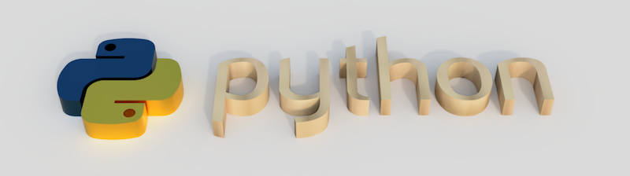
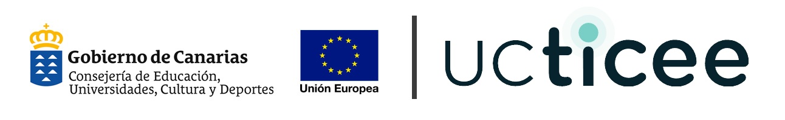

Introducción al lenguaje de programación Python
===============================================

Manuales para el curso de **Introducción al lenguaje de programación Python** dentro del proyecto `UCTICEE`_ (Uso y Calidad de las TIC en el entorno educativo) cofinanciado al 85% por el `Fondo Europeo de Desarrollo Regional`_, en el marco del `Plan Canario de Formación del profesorado`_ de la `Consejería de Educación del Gobierno de Canarias`_.

.. only:: html

   .. tip::
      * Para volver al comienzo de la página, en cualquier lugar del sitio, basta con pulsar en el logotipo superior izquierdo.
      * Para ver los ejemplos de código sin símbolos previos ni salida esperada, basta con pulsar en el icono `>>>` superior derecho dentro de cada bloque.

.. toctree::
   :maxdepth: 2

   introduction
   devenv
   datatypes
   controlflow
   datastructures
   modularity

.. _UCTICEE: http://www3.gobiernodecanarias.org/medusa/ecoescuela/ucticee/
.. _Fondo Europeo de Desarrollo Regional: https://ec.europa.eu/regional_policy/es/funding/erdf/
.. _Plan Canario de Formación del profesorado: https://www3.gobiernodecanarias.org/medusa/perfeccionamiento/areapersonal/aulatic.php?id=30
.. _Consejería de Educación del Gobierno de Canarias: https://www.gobiernodecanarias.org/educacion/web/
