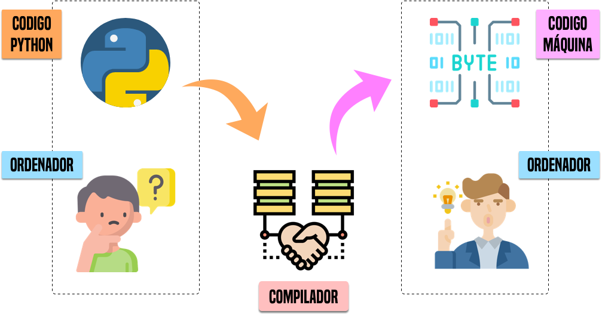
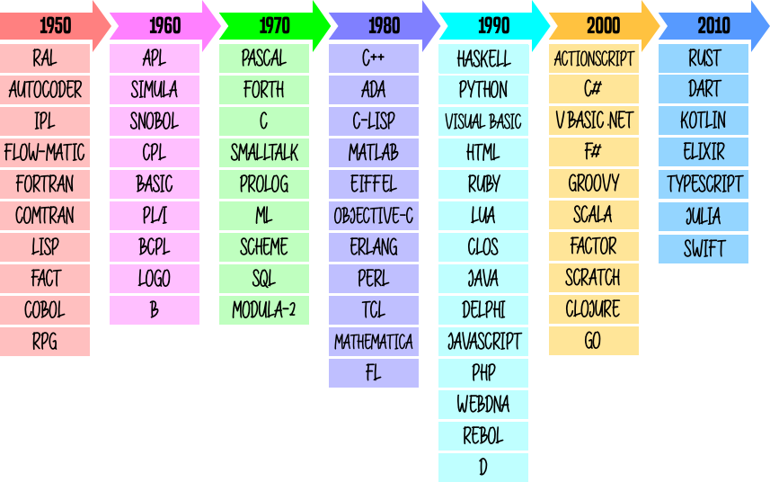

============
Introducción
============

Este capítulo es una introducción a la programación para conocer, desde un enfoque sencillo pero aclaratorio, los mecanismos que hay detrás de ello. [#hello]_

*************************
Lenguajes de programación
*************************

Los ordenadores son dispositivos complejos pero están diseñados para hacer una cosa bien: **ejecutar aquello que se les indica**. La cuestión es cómo indicar a un ordenador lo que queremos que ejecute. Esas indicaciones se llaman técnicamente **instrucciones** y se expresan en un lenguaje. Podríamos decir que **programar** consiste en escribir instrucciones para que sean ejecutadas por un ordenador. El lenguaje que utilizamos para ello se denomina **lenguaje de programación**.

Código máquina
==============

Pero aún seguimos con el problema de cómo hacer que un ordenador (o máquina) entienda el lenguaje de programación. A priori podríamos decir que un ordenador sólo entiende un lenguaje muy "simple" denominado `código máquina`_. En este lenguaje se utilizan únicamente los símbolos **0** y **1** en representación de los *niveles de tensión* alto y bajo, que al fin y al cabo, son los estados que puede manejar un circuito digital. Hablamos de `sistema binario`_. Si tuviéramos que escribir programas de ordenador en este formato sería una tarea ardua, pero afortunadamente se han ido creando con el tiempo lenguajes de programación intermedios que, posteriormente, son convertidos a código máquina.

Si intentamos visualizar un programa en código máquina, únicamente obtendríamos una secuencia de ceros y unos:

.. code-block:: raw

    00001000 00000010 01111011 10101100 10010111 11011001 01000000 01100010 
    00110100 00010111 01101111 10111001 01010110 00110001 00101010 00011111 
    10000011 11001101 11110101 01001110 01010010 10100001 01101010 00001111 
    11101010 00100111 11000100 01110101 11011011 00010110 10011111 01010110 

Ensamblador
===========

El primer lenguaje de programación que encontramos en esta "escalada" es **ensamblador**. Veamos un `ejemplo de código en ensamblador`_ del típico programa que se escribe por primera vez, el *"Hello, World"*:

.. code-block:: Nasm

             global    _start

             section   .text
    _start:  mov       rax, 1              ; system call for write
             mov       rdi, 1              ; file handle 1 is stdout
             mov       rsi, message        ; address of string to output
             mov       rdx, 13             ; number of bytes
             syscall                       ; invoke OS to do the write
             mov       rax, 60             ; system call for exit
             xor       rdi, rdi            ; exit code 0
             syscall                       ; invoke operating system to exit

             section   .data
    message: db        "Hello, World", 10  ; note the newline at the end

Aunque resulte difícil de creer, lo "único" que hace este programa es mostrar en la pantalla de nuestro ordenador la frase "Hello, World", pero además teniendo en cuenta que sólo funcionará para una `arquitectura x86`_.

C
=

Aunque el lenguaje ensamblador nos facilita un poco la tarea de desarrollar programas, sigue siendo bastante complicado ya que las instrucciones son muy específicas y no proporcionan una semántica entendible. Uno de los lenguajes que vino a suplir -- en parte -- estos obstáculos fue `C`_. Considerado para muchas personas como un referente en cuanto a los lenguajes de programación, permite hacer uso de instrucciones más claras y potentes. El mismo ejemplo anterior del programa *"Hello, World"* se escribiría así en lenguaje *C*:

.. code-block:: C

    #include <stdio.h>

    int main() {
        printf("Hello, World");
        return 0;
    }

Python
======

Si seguimos "subiendo" en esta lista de lenguajes de programación, podemos llegar hasta `Python`_. Se dice que es un lenguaje de *más alto nivel* en el sentido de que sus instrucciones son más entendibles por un humano. Veamos cómo se escribiría el programa *"Hello, World"* en el lenguaje de programación Python:

.. code-block::

    print('Hello, World')

¡Pues así de fácil! Hemos pasado de *código máquina* (ceros y unos) a *código Python* en el que se puede entender perfectamente lo que estamos indicando al ordenador. La pregunta que surge es: ¿cómo entiende una máquina lo que tiene que hacer si le pasamos un programa hecho en Python (o cualquier otro lenguaje de alto nivel)? La respuesta es un **compilador**.

Compiladores
============

Los `compiladores`_ son programas que convierten un lenguaje "cualquiera" en *código máquina*. Se pueden ver como traductores, permitiendo a la máquina interpretar lo que queremos hacer.

    Esquema de funcionamiento de un compilador [#compiler]_

.. note::

    Para ser más exactos, en Python hablamos de un **intérprete** en vez de un compilador, pero a los efectos es prácticamente lo mismo. La diferencia está en que el intérprete realiza la "compilación" (*interpretación*) y la "ejecución" de una vez, mientras que el compilador genera un formato "ejecutable" (*código objeto*) que se ejecuta en otra fase posterior.

****************
Algo de historia
****************

Computadores
============

La historia de la programación está relacionada directamente con la aparición de los computadores, que ya desde el siglo XV tuvo sus inicios con la construcción de una máquina que realizaba operaciones básicas y raíces cuadradas (`Gottfried Wilheml von Leibniz`_); aunque en realidad la primera gran influencia hacia la creación de los computadores fue la  máquina diferencial para el cálculo de polinomios, proyecto no concluido de `Charles Babbage`_ (1793-1871)  con el apoyo de `Lady Ada Countess of Lovelace`_ (1815-1852), primera persona que incursionó en la programación y de quien proviene el nombre del lenguaje de programación `ADA`_ creado por el DoD (Departamento de defensa de Estados Unidos) en la década de 1970.

.. figure:: img/ada-lovelace.jpg

    Ada Lovelace: primera programadora de la historia [#adalovelace]_

Hitos de la computación
=======================

La siguiente tabla es un resumen de los principales hitos en la historia de la computación:

.. csv-table::
    :file: tables/prog_milestones.csv
    :widths: 30, 60, 10
    :header-rows: 1

Luego los avances en las ciencias informáticas han sido muy acelerados, se reemplazaron los `tubos de vacío`_ por `transistores`_ en 1958 y en el mismo año, se sustituyeron por `circuitos integrados`_, y en 1961 se miniaturizaron en **chips de silicio**. En 1971 apareció el primer microprocesador de Intel; y en 1973 el primer sistema operativo CP/M.  El primer computador personal es comercializado por IBM en el año 1980.

De los computadores a la programación
=====================================

De acuerdo a este breve viaje por la historia, la programación está vinculada a la aparición de los computadores, y los lenguajes tuvieron también su evolución. Inicialmente, como ya hemos visto, se programaba en **código binario**, es decir en cadenas de 0s y 1s, que es el lenguaje que entiende directamente el computador, tarea extremadamente difícil; luego se creó el **lenguaje ensamblador**, que aunque era lo mismo que programar en binario, al estar en letras era más fácil de recordar.  Posteriormente aparecieron **lenguajes de alto nivel**, que en general, utilizan palabras en inglés, para dar las órdenes a seguir, para lo cual utilizan un proceso intermedio entre el lenguaje máquina y el nuevo código llamado código fuente, este proceso puede ser un compilador o un intérprete.

Un **compilador** lee todas las instrucciones y genera un resultado; un **intérprete** ejecuta y genera resultados línea a línea. En cualquier caso han aparecido nuevos lenguajes de programación, unos denominados estructurados y en la actualidad en cambio los lenguajes orientados a objetos y los lenguajes orientados a eventos. [#prog-history]_

Cronología de lenguajes de programación
=======================================

Desde la década de los 1950 se han sucedido multitud de lenguajes de programación que cada vez incorporan más funcionalidades destinadas a cubrir las necesidades del desarrollo de aplicaciones. A continuación se muestra una tabla con la historia de los lenguajes de programación más destacados:

    Cronología de los lenguajes de programación más destacados

Creadores de lenguajes de programación
======================================

El avance de la computación está íntimamente relacionado con el desarrollo de los lenguajes de programación. Sus creadores y creadoras juegan un *rol fundamental* en la historia tecnológica. Veamos algunas de estas personas: [#proglangs-creators]_

.. csv-table::
    :file: tables/proglangs_creators.csv
    :widths: 30, 70
    :header-rows: 1

|

.. --------------- Footnotes ---------------

.. [#hello] Foto original de portada por `Jon Tyson`_ en Unsplash.
.. [#compiler] Iconos originales por `Flaticon`_
.. [#adalovelace] Fuente: `Meatze`_
.. [#prog-history] Fuente: `Universidad Técnica del Norte`_
.. [#proglangs-creators] Fuente: `Wikipedia <https://es.wikipedia.org/wiki/Historia_de_los_lenguajes_de_programaci%C3%B3n>`_

|

.. --------------- Hyperlinks ---------------

.. _ejemplo de código en ensamblador: https://cs.lmu.edu/~ray/notes/x86assembly/
.. _código máquina: https://es.wikipedia.org/wiki/Lenguaje_de_m%C3%A1quina
.. _sistema binario: https://es.wikipedia.org/wiki/Sistema_binario
.. _arquitectura x86: https://es.wikipedia.org/wiki/X86
.. _C: https://es.wikipedia.org/wiki/C_(lenguaje_de_programaci%C3%B3n)
.. _Python: https://es.wikipedia.org/wiki/Python
.. _compiladores: https://es.wikipedia.org/wiki/Compilador
.. _Jon Tyson: https://unsplash.com/@jontyson?utm_source=unsplash&utm_medium=referral&utm_content=creditCopyText
.. _Flaticon: http://flaticon.com/
.. _Gottfried Wilheml von Leibniz: https://es.wikipedia.org/wiki/Gottfried_Leibniz
.. _Charles Babbage: https://es.wikipedia.org/wiki/Charles_Babbage
.. _Lady Ada Countess of Lovelace: https://es.wikipedia.org/wiki/Ada_Lovelace
.. _ADA: https://es.wikipedia.org/wiki/Ada_(lenguaje_de_programaci%C3%B3n)
.. _Meatze: https://www.meatze.eus/blog-igualdad/la-primera-programadora-pertenece-al-siglo-xix-ada-lovelace/
.. _tubos de vacío: https://es.wikipedia.org/wiki/Computadora_de_tubos_de_vac%C3%ADo
.. _transistores: https://es.wikipedia.org/wiki/Transistor
.. _circuitos integrados: https://es.wikipedia.org/wiki/Circuito_integrado
.. _Universidad Técnica del Norte: http://www.utn.edu.ec/reduca/programacion/fundamentos/un_poco_de_historia.html
