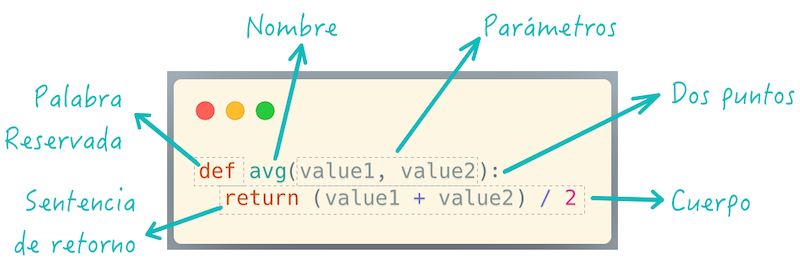
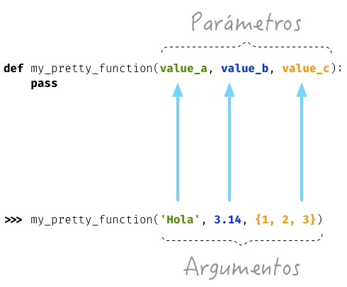

*********
Funciones
*********

Hasta ahora todo lo que hemos hecho han sido breves fragmentos de código Python. Esto puede ser razonable para pequeñas tareas, pero nadie quiere reescribir los fragmentos de código cada vez. Necesitamos una manera de organizar nuestro código en piezas manejables. [#brewery-unsplash]_ 

El primer paso para la **reutilización de código** es la **función**. Se trata de un trozo de código con nombre y separado del resto. Puede tomar cualquier número y tipo de *parámetros* y devolver cualquier número y tipo de *resultados*. 

Básicamente podemos hacer dos cosas con una función:

- Definirla (con cero o más parámetros).
- Invocarla (y obtener cero o más resultados).

Definir una función
===================

Para definir una función en Python debemos usar la palabra reservada ``def`` seguida del nombre de la función con paréntesis rodeando a los parámetros de entrada y finalmente dos puntos ``:``

    Definición de una función en Python
   
.. warning:: Prestar especial atención a los dos puntos ``:`` porque suelen olvidarse en la *definición de la función*.

Hagamos una primera función sencilla que no recibe parámetros::

    def say_hello():
        print('Hello!')

- Nótese la :ref:`indentación <controlflow/conditionals:Definición de bloques>` (sangrado) del *cuerpo* de la función.
- Los *nombres de las funciones* siguen :ref:`las mismas reglas que las variables <datatypes/data:Variables>`.

Invocar una función
~~~~~~~~~~~~~~~~~~~

Para invocar (o "llamar") a una función basta con escribir su nombre y utilizar paréntesis. En el caso de la función sencilla (vista anteriormente) se haría así:

.. code-block::
    :emphasize-lines: 5

    >>> def say_hello():
    ...     print('Hello!')
    ...

    >>> say_hello()
    Hello!

Como era de esperar, al invocar a la función obtenemos un mensaje por pantalla, fruto de la ejecución del cuerpo de la función.

Retornar un valor
~~~~~~~~~~~~~~~~~

Las funciones pueden retornar (o "devolver") un valor. Veamos un ejemplo muy sencillo::

    >>> def agree():
    ...     return True
    ...

    >>> agree()
    True

Pero no sólo podemos invocar a la función directamente, también la podemos integrar en otras expresiones. Por ejemplo en condicionales::

    >>> if agree():
    ...     print('Trato hecho')
    ... else:
    ...     print('Hasta la próxima')
    ...
    Trato hecho

.. note:: En la sentencia ``return`` podemos incluir variables y expresiones, no únicamente literales.

En aquellos casos en los que una función no tenga un ``return`` explícito, siempre devolverá ``None``.

.. code-block::

    >>> def foo():
    ...     x = 'foo'
    ...

    >>> print(foo())
    None

Parámetros y argumentos
=======================

Vamos a empezar a crear funciones que reciben **parámetros**. En este caso escribiremos una función ``echo()`` que recibe el parámetro ``anything`` y muestra esa variable dos veces separada por un espacio::

    >>> def echo(anything):
    ...     return anything + ' ' + anything
    ...

    >>> echo('Is anybody out there?')
    'Is anybody out there? Is anybody out there?'

.. note:: En este caso, ``'Is anybody out there?'`` es un **argumento** de la función.

Cuando llamamos a una función con *argumentos*, los valores de estos argumentos se copian en los correspondientes *parámetros* dentro de la función:

   Parámetros y argumentos de una función

.. tip:: La sentencia ``pass`` permite "no hacer nada". Es una especie de "*placeholder*".

Veamos otra función con algo más de lógica de negocio: [#blogic]_

.. code-block::

    >>> def fruit_detection(color):
    ...     if color == 'red':
    ...         return "It's an apple"
    ...     elif color == 'yellow':
    ...         return "It's a banana"
    ...     elif color == 'green':
    ...         return "It's a kiwi"
    ...     else:
    ...         return f"I don't know about the color {color}"
    ...

    >>> fruit = fruit_detection('green')

    >>> fruit
    "It's a kiwi"

Argumentos posicionales
~~~~~~~~~~~~~~~~~~~~~~~

Los **argumentos posicionales** son aquellos argumentos que se copian en sus correspondientes parámetros **en orden**. Vamos a mostrar un ejemplo definiendo una función que construye y devuelve un diccionario a partir de los argumentos recibidos::

    >>> def menu(wine, entree, dessert):
    ...     return {'wine': wine, 'entree': entree, 'dessert': dessert}
    ...

Una posible llamada a la función con argumentos posicionales sería la siguiente::

    >>> menu('Flor de Chasna', 'Garbanzas', 'Quesillo')
    {'wine': 'Flor de Chasna', 'entree': 'Garbanzas', 'dessert': 'Quesillo'}

Lo que ha sucedido es un **mapeo** directo entre argumentos y parámetros en el mismo orden que estaban definidos:

+--------------------+-------------+
|     Argumento      |  Parámetro  |
+====================+=============+
| ``Flor de chasna`` | ``wine``    |
+--------------------+-------------+
| ``Garbanzas``      | ``entree``  |
+--------------------+-------------+
| ``Quesillo``       | ``dessert`` |
+--------------------+-------------+

.. note:: Una clara desventaja del uso de argumentos posicionales es que se necesita recordar el significado de cada posición.

Argumentos por nombre
~~~~~~~~~~~~~~~~~~~~~

Para evitar la confusión que pueden producir los argumentos posicionales, es posible especificar argumentos **usando el nombre de los correspondientes parámetros**, incluso en un orden distinto a cómo están definidos en la función::

    >>> menu(entree='Queso asado', dessert='Postre de café', wine='Arautava')
    {'wine': 'Arautava', 'entree': 'Queso asado', 'dessert': 'Postre de café'}

Incluso podemos *mezclar* argumentos posicionales y argumentos por nombre::

    >>> menu('Marba', dessert='Frangollo', entree='Croquetas')
    {'wine': 'Marba', 'entree': 'Croquetas', 'dessert': 'Frangollo'}

.. note:: Si se llama a una función mezclando argumentos posicionales y por nombre, los argumentos posicionales deben ir primero.

.. code-block::

    >>> menu(dessert='Frangollo', entree='Croquetas', 'Marba')
      File "<stdin>", line 1
    SyntaxError: positional argument follows keyword argument

Parámetros por defecto
~~~~~~~~~~~~~~~~~~~~~~

Es posible especificar **valores por defecto** en los parámetros de una función. El valor por defecto se usará cuando en la llamada a la función no se haya proporcionado el correspondiente argumento.

Supongamos que nos gusta mucho el *Tiramisú*. Podemos especificar en la definición de la función que si no se especifica el postre, éste sea siempre *Tiramisú*::

    >>> def menu(wine, entree, dessert='Tiramisú'):
    ...     return {'wine': wine, 'entree': entree, 'dessert': dessert}
    ...

Llamada a la función sin especificar postre::

    >>> menu('Ignios', 'Ensalada')
    {'wine': 'Ignios', 'entree': 'Ensalada', 'dessert': 'Tiramisú'}

Llamada a la función indicando un postre concreto::

    >>> menu('Tajinaste', 'Revuelto de setas', 'Helado')
    {'wine': 'Tajinaste', 'entree': 'Revuelto de setas', 'dessert': 'Helado'}

.. important:: Los valores por defecto en los parámetros se calculan cuando se **define** la función, no cuando se **ejecuta**.

.. --------------- Footnotes ---------------

.. [#brewery-unsplash] Foto original por `Nathan Dumlao`_ en Unsplash.
.. [#blogic] Término para identificar el "algoritmo" o secuencia de instrucciones derivadas del procesamiento que corresponda.

.. --------------- Hyperlinks ---------------

.. _Nathan Dumlao: https://unsplash.com/@nate_dumlao?utm_source=unsplash&utm_medium=referral&utm_content=creditCopyText
